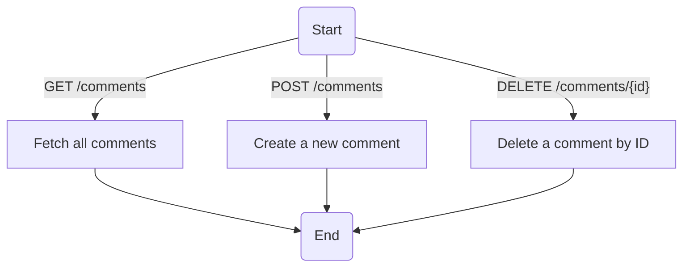
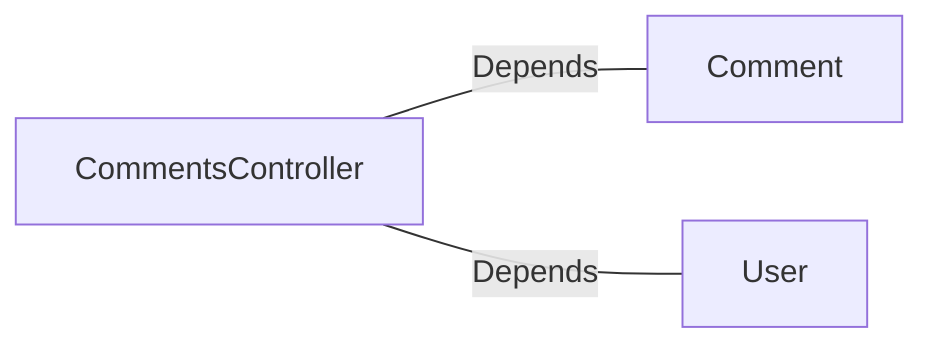

# CommentsController.java: REST API for Managing Comments

## Overview
The `CommentsController` class provides a REST API for managing comments. It includes endpoints for retrieving, creating, and deleting comments. The API uses token-based authentication and supports cross-origin requests. Additionally, it defines custom exceptions for handling errors.

## Process Flow

## Insights
- **Authentication**: The API uses token-based authentication via the `x-auth-token` header. The `User.assertAuth` method is called to validate the token.
- **Cross-Origin Requests**: All endpoints are configured to allow cross-origin requests from any origin using `@CrossOrigin(origins = "*")`.
- **Error Handling**: Custom exceptions (`BadRequest` and `ServerError`) are defined to handle specific error scenarios with appropriate HTTP status codes.
- **Comment Management**: The `Comment` class is used for operations like fetching, creating, and deleting comments. However, the implementation of the `Comment` class is not provided in this snippet.
- **Input Validation**: The `CommentRequest` class is used to encapsulate the input for creating comments. It includes `username` and `body` fields.

## Dependencies

- `Comment`: Used for fetching, creating, and deleting comments. The methods `fetch_all`, `create`, and `delete` are invoked.
- `User`: Used for authentication via the `assertAuth` method.

## Vulnerabilities
1. **Hardcoded Secret**: The `secret` value is injected from the application properties (`app.secret`). If this secret is not securely stored or rotated, it could lead to security vulnerabilities.
2. **Cross-Origin Policy**: Allowing all origins (`@CrossOrigin(origins = "*")`) can expose the API to potential abuse from malicious domains.
3. **Authentication Bypass**: The `User.assertAuth` method is used for authentication, but its implementation is not provided. If this method is not robust, it could lead to authentication bypass.
4. **Error Handling**: The custom exceptions (`BadRequest` and `ServerError`) do not log the errors, which could make debugging and monitoring difficult.
5. **Input Validation**: The `CommentRequest` class does not validate the `username` and `body` fields, which could lead to injection attacks or invalid data being processed.

## Data Manipulation (SQL)
- **Comment**: Likely interacts with a database for fetching, creating, and deleting comments. However, the SQL operations are not explicitly shown in this snippet.
