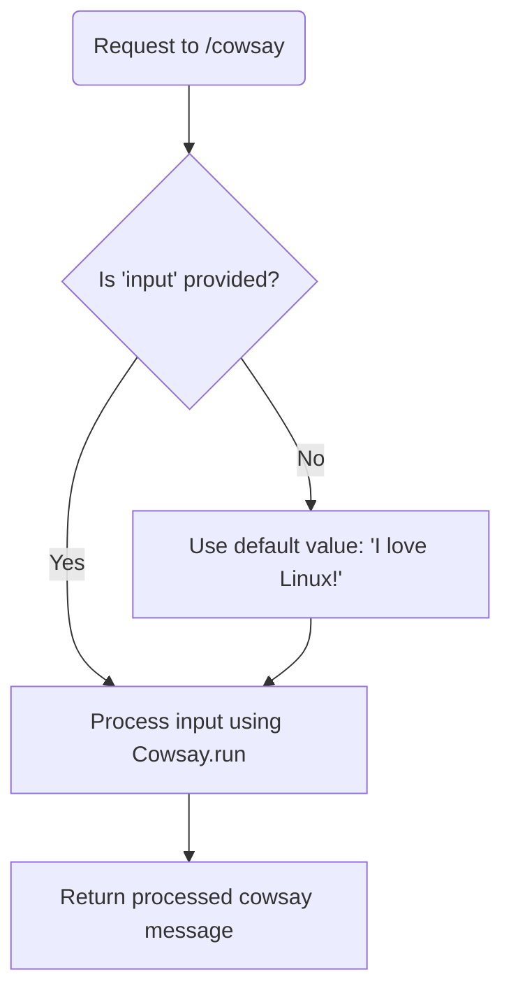
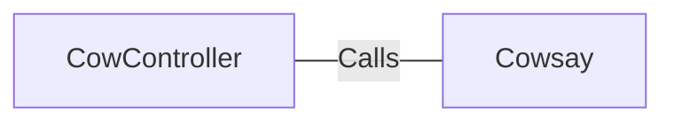

# CowController.java: REST Controller for CowSay Functionality

## Overview
The `CowController` class is a Spring Boot REST controller that provides an endpoint for generating "cowsay" messages. It accepts user input via a query parameter and processes it using the `Cowsay.run` method.

## Process Flow

## Insights
- The class is annotated with `@RestController` and `@EnableAutoConfiguration`, making it a Spring Boot REST controller with auto-configuration enabled.
- The `/cowsay` endpoint accepts a query parameter `input`. If no input is provided, it defaults to "I love Linux!".
- The `Cowsay.run` method is used to process the input and generate the cowsay message.
- The code does not validate or sanitize the `input` parameter, which could lead to potential vulnerabilities if `Cowsay.run` executes untrusted input.

## Vulnerabilities
1. **Potential Command Injection**:
   - If the `Cowsay.run` method executes system commands or interprets the input in an unsafe manner, it could be exploited for command injection.
   - Example: An attacker could pass malicious input that exploits the underlying implementation of `Cowsay.run`.

2. **Lack of Input Validation**:
   - The `input` parameter is directly passed to `Cowsay.run` without any validation or sanitization. This could lead to unexpected behavior or security risks.

3. **Default Input Exposure**:
   - The default input "I love Linux!" is hardcoded, which might not be suitable for all use cases. It could also expose unnecessary information about the system's preferences.

## Dependencies

- `Cowsay`: Processes the input and generates the cowsay message.

## External References
- `Cowsay`: The `Cowsay.run` method is called with the `input` parameter to generate the cowsay message. The exact implementation of `Cowsay.run` is not provided, but its behavior is critical to the functionality and security of the endpoint.
