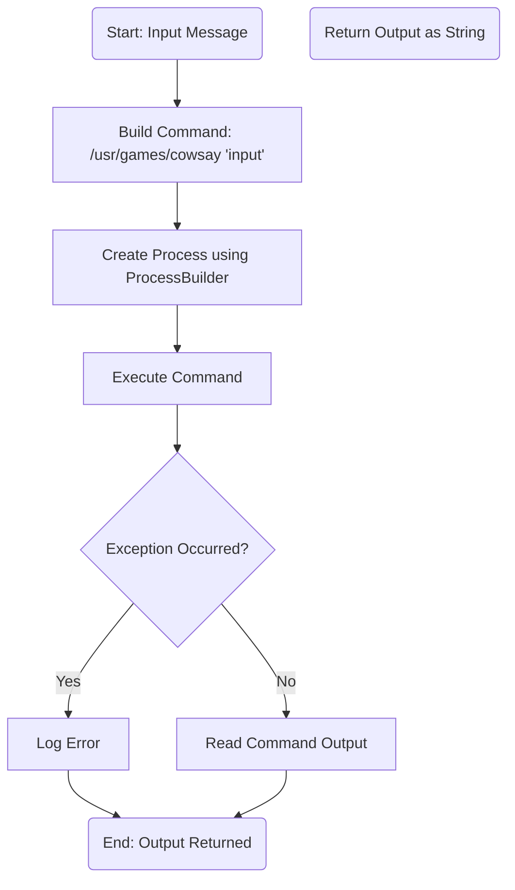
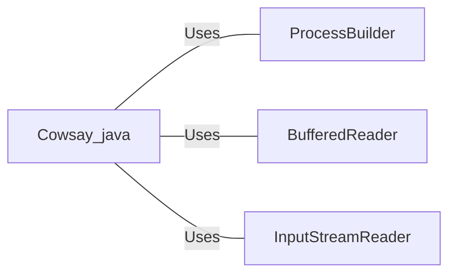

# Cowsay.java: Command Execution Wrapper for Cowsay

## Overview
The `Cowsay` class provides functionality to execute the `cowsay` command-line tool, which generates ASCII art of a cow saying a given input message. It uses Java's `ProcessBuilder` to execute the command and captures the output.

## Process Flow

## Insights
- **Command Injection Vulnerability**: The code concatenates user input directly into the command string without sanitization, making it vulnerable to command injection attacks. Malicious input could execute arbitrary commands on the system.
- **Error Handling**: The code catches exceptions but only logs the stack trace without providing meaningful feedback or handling the error gracefully.
- **Hardcoded Command Path**: The path to the `cowsay` executable (`/usr/games/cowsay`) is hardcoded, which may cause issues if the executable is located elsewhere on the system.
- **Resource Management**: The `BufferedReader` is not closed explicitly, which could lead to resource leaks.

## Vulnerabilities
1. **Command Injection**:
   - The input is directly concatenated into the command string without validation or escaping, allowing attackers to inject malicious commands.
   - Example: If `input` is `"hello'; rm -rf /"`, the resulting command would be `/usr/games/cowsay 'hello'; rm -rf /`, which could delete files on the system.

2. **Improper Error Handling**:
   - Exceptions are logged but not handled properly, which could lead to unhandled scenarios or lack of meaningful feedback to the user.

3. **Resource Leak**:
   - The `BufferedReader` is not closed explicitly, which could lead to resource leaks.

## Dependencies

- `ProcessBuilder`: Used to create and execute the external `cowsay` command.
- `BufferedReader`: Used to read the output of the executed command.
- `InputStreamReader`: Wraps the input stream of the process for reading.

## Recommendations
- **Input Sanitization**: Validate and sanitize user input to prevent command injection. Use libraries or frameworks that safely handle command execution.
- **Error Handling**: Implement meaningful error handling and provide feedback to the user.
- **Resource Management**: Use try-with-resources to ensure proper closure of resources like `BufferedReader`.
- **Dynamic Command Path**: Avoid hardcoding the path to the `cowsay` executable. Use configuration files or environment variables to specify the path.
