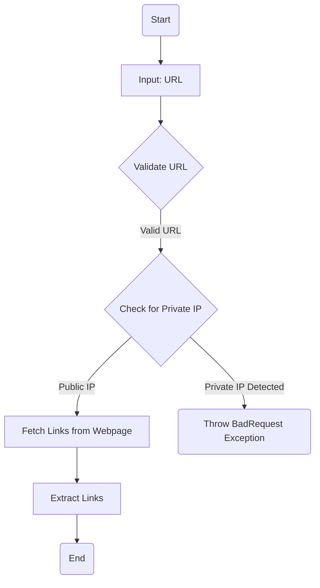
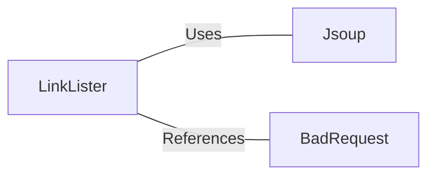

# LinkLister.java: Web Link Extractor

## Overview
The `LinkLister` class is responsible for extracting hyperlinks from a given webpage URL. It provides two methods for retrieving links: `getLinks` and `getLinksV2`. The latter includes additional validation to prevent the use of private IP addresses.

## Process Flow

## Insights
- **Core Functionality**: Extracts all hyperlinks (`<a>` tags) from a webpage using the `Jsoup` library.
- **Validation in `getLinksV2`**: Ensures the URL does not point to a private IP address (e.g., `172.*`, `192.168.*`, `10.*`).
- **Error Handling**: Throws a custom `BadRequest` exception for invalid URLs or private IPs.
- **Dependency on Jsoup**: Utilizes `Jsoup` for HTML parsing and link extraction.

## Dependencies

- `Jsoup`: Used for connecting to the URL, parsing the HTML document, and extracting links.
- `BadRequest`: Custom exception class used for error handling in `getLinksV2`.

## Vulnerabilities
1. **Private IP Validation**:
   - The validation logic in `getLinksV2` only checks for specific private IP ranges (`172.*`, `192.168.*`, `10.*`). It does not account for other private or reserved IP ranges (e.g., `127.0.0.1`, `169.254.*`, or `::1` for IPv6).
   - Recommendation: Enhance the validation logic to cover all private and reserved IP ranges.

2. **Unrestricted External URL Access**:
   - The `getLinks` method directly connects to the provided URL without any validation. This could lead to SSRF (Server-Side Request Forgery) vulnerabilities if the input URL is malicious.
   - Recommendation: Implement URL validation in `getLinks` similar to `getLinksV2`.

3. **Error Handling in `getLinksV2`**:
   - The `catch` block in `getLinksV2` rethrows exceptions as `BadRequest` without differentiating between different types of errors (e.g., malformed URLs, connection issues).
   - Recommendation: Provide more granular error handling to distinguish between different failure scenarios.

4. **Potential Information Disclosure**:
   - The `System.out.println(host)` statement in `getLinksV2` could inadvertently expose sensitive information about the host being processed.
   - Recommendation: Remove or replace this debug statement with proper logging mechanisms.

## Data Manipulation (SQL)
Not applicable. The code does not interact with any SQL databases.
