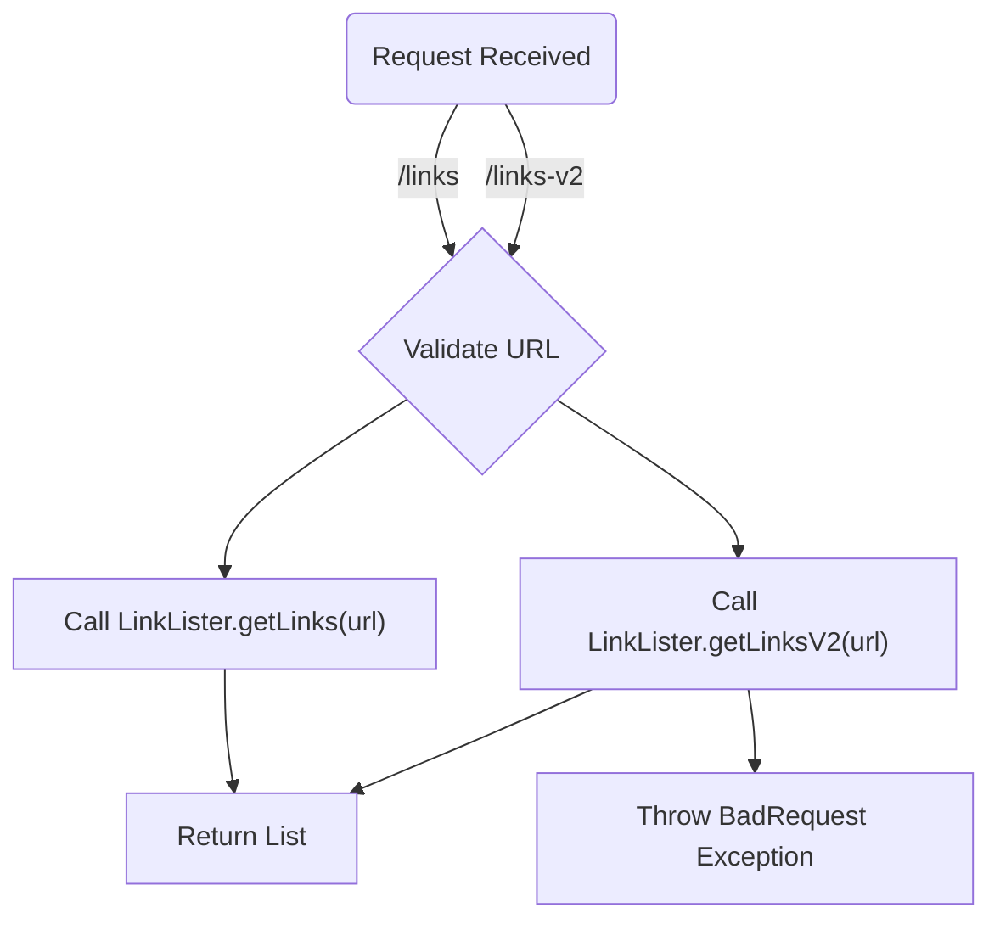
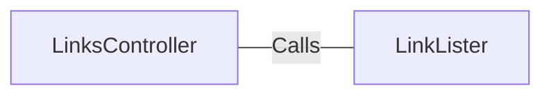

# LinksController.java: REST API for Extracting Links

## Overview
The `LinksController` class is a REST API controller that provides endpoints for extracting links from a given URL. It uses the `LinkLister` utility to process the URL and return a list of links. The class is built using Spring Boot and includes two endpoints: `/links` and `/links-v2`.

## Process Flow

## Insights
- The class defines two endpoints:
  - `/links`: Extracts links using the `LinkLister.getLinks(url)` method.
  - `/links-v2`: Extracts links using the `LinkLister.getLinksV2(url)` method, which may throw a `BadRequest` exception.
- Both endpoints expect a `url` parameter as input and return a list of links in JSON format.
- The `LinkLister` utility is responsible for the actual link extraction logic.
- The `@EnableAutoConfiguration` annotation is used to automatically configure the Spring Boot application.

## Dependencies

- `LinkLister`: Provides methods `getLinks(url)` and `getLinksV2(url)` for extracting links from the given URL.

## Vulnerabilities
- **Potential URL Injection**: The `url` parameter is directly passed to the `LinkLister` methods without validation or sanitization. This could lead to security vulnerabilities such as URL injection or exploitation of external services.
- **Exception Handling**: The `/links-v2` endpoint may throw a `BadRequest` exception, but the code does not include proper exception handling mechanisms to return meaningful error responses to the client.
- **Error Handling in `/links`**: The `/links` endpoint may throw an `IOException`, but there is no mechanism to handle this exception gracefully or provide feedback to the client.
- **Lack of Input Validation**: The `url` parameter is not validated to ensure it is a properly formatted and safe URL. This could lead to unexpected behavior or security risks.

## Recommendations
- Implement input validation for the `url` parameter to ensure it is properly formatted and safe.
- Add exception handling mechanisms to return meaningful error responses to the client.
- Consider sanitizing the `url` parameter to prevent potential security vulnerabilities.
- Review the `LinkLister` utility for additional security concerns, especially if it interacts with external services.
