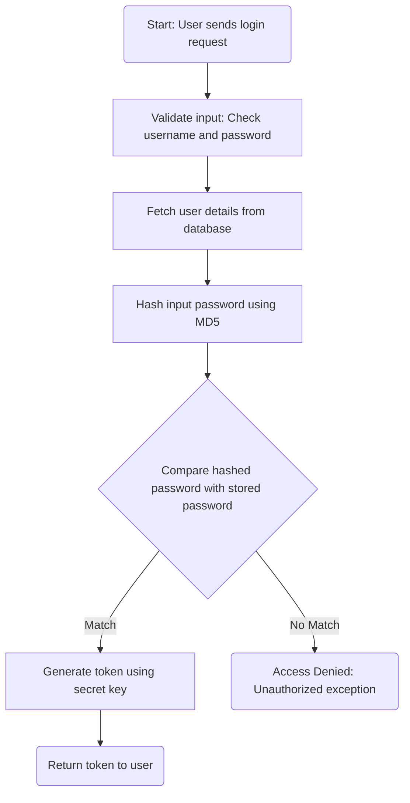
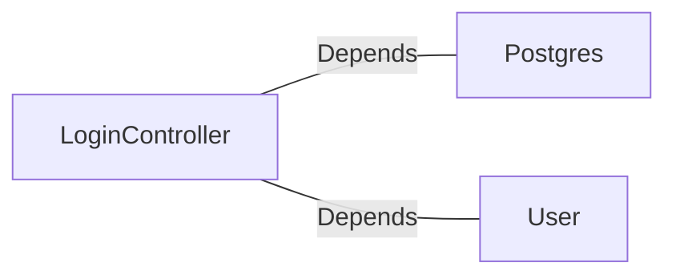

# LoginController.java: Login Authentication Controller

## Overview
The `LoginController` class is a REST API controller responsible for handling user login requests. It validates user credentials against stored data and generates a token for successful authentication. The controller uses Spring Boot annotations for configuration and routing.

## Process Flow

## Insights
- The `@CrossOrigin` annotation allows requests from any origin, which may pose a security risk if not properly restricted.
- Passwords are hashed using MD5, which is considered insecure for cryptographic purposes due to vulnerabilities such as collision attacks.
- The `secret` key is injected using the `@Value` annotation, which is used to generate tokens for authenticated users.
- The `Unauthorized` exception is thrown when authentication fails, returning a 401 HTTP status code.
- The `LoginRequest` and `LoginResponse` classes are simple data structures for handling input and output of the login process.

## Vulnerabilities
1. **Insecure Password Hashing**:
   - MD5 is used for hashing passwords, which is outdated and vulnerable to collision attacks. Consider using a stronger hashing algorithm like bcrypt or Argon2.

2. **Unrestricted Cross-Origin Resource Sharing (CORS)**:
   - The `@CrossOrigin(origins = "*")` annotation allows requests from any origin, which can lead to security risks such as Cross-Site Request Forgery (CSRF). Restrict origins to trusted domains.

3. **Hardcoded Secret Key**:
   - The `secret` key is injected from application properties but is not encrypted or secured. Ensure the secret is stored securely and rotated periodically.

4. **Potential SQL Injection**:
   - The `User.fetch(input.username)` method is not shown in the code, but if it directly uses the `username` without sanitization, it may be vulnerable to SQL injection.

5. **Lack of Rate Limiting**:
   - The login endpoint does not implement rate limiting, making it susceptible to brute force attacks.

## Dependencies

- `Postgres`: Used for hashing passwords with the `md5` method.
- `User`: Represents the user entity and is used to fetch user details and generate tokens.

## Data Manipulation (SQL)
- **User**: Likely involves SELECT operations to fetch user details based on the provided username.
