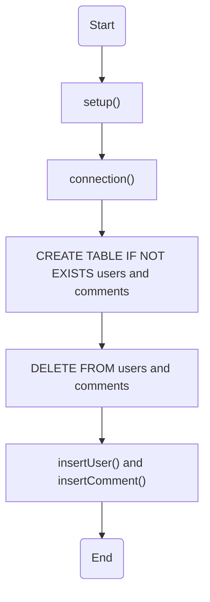
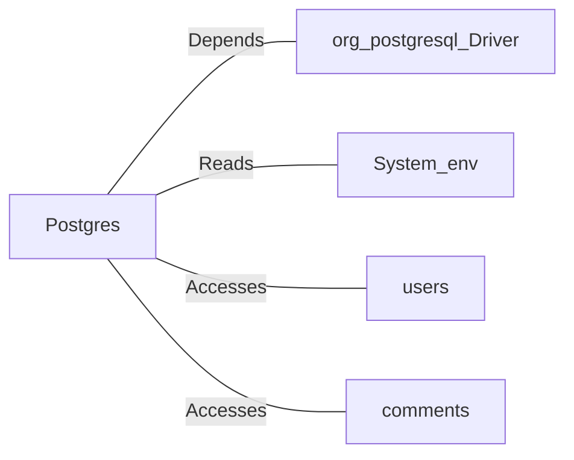

# Postgres.java: Database Setup and Interaction Utility

## Overview
The `Postgres` class is responsible for setting up and interacting with a PostgreSQL database. It provides methods to establish a database connection, create schema tables, insert seed data, and perform basic operations such as inserting users and comments. Additionally, it includes a utility method for generating MD5 hash values.

## Process Flow

## Insights
- **Database Connection**: The `connection()` method dynamically constructs the database connection string using environment variables (`PGHOST`, `PGDATABASE`, `PGUSER`, `PGPASSWORD`).
- **Schema Creation**: The `setup()` method ensures the `users` and `comments` tables exist, cleaning up any existing data before inserting seed data.
- **MD5 Hashing**: The `md5()` method generates an MD5 hash for passwords, which is used for storing hashed passwords in the database.
- **Seed Data**: The `setup()` method inserts predefined users and comments into the database for initial setup.
- **Prepared Statements**: Both `insertUser()` and `insertComment()` use prepared statements to prevent SQL injection vulnerabilities.
- **UUID Generation**: Unique identifiers for users and comments are generated using `UUID.randomUUID()`.

## Dependencies

- `org.postgresql.Driver`: Required for establishing a connection to the PostgreSQL database.
- `System.env`: Reads environment variables (`PGHOST`, `PGDATABASE`, `PGUSER`, `PGPASSWORD`) for database connection configuration.
- `users`: Table for storing user information, including hashed passwords.
- `comments`: Table for storing user comments.

## Data Manipulation (SQL)
### Table Structures
#### `users` Table
| Attribute    | Type          | Description                                      |
|--------------|---------------|--------------------------------------------------|
| `user_id`    | `VARCHAR(36)` | Primary key, unique identifier for each user.    |
| `username`   | `VARCHAR(50)` | Unique username for the user.                    |
| `password`   | `VARCHAR(50)` | MD5 hashed password.                             |
| `created_on` | `TIMESTAMP`   | Timestamp when the user was created.             |
| `last_login` | `TIMESTAMP`   | Timestamp of the user's last login.              |

#### `comments` Table
| Attribute    | Type          | Description                                      |
|--------------|---------------|--------------------------------------------------|
| `id`         | `VARCHAR(36)` | Primary key, unique identifier for each comment. |
| `username`   | `VARCHAR(36)` | Username of the user who made the comment.       |
| `body`       | `VARCHAR(500)`| Content of the comment.                          |
| `created_on` | `TIMESTAMP`   | Timestamp when the comment was created.          |

### SQL Operations
- `users`: 
  - **INSERT**: Adds new users with hashed passwords and timestamps.
  - **DELETE**: Removes all existing user records during setup.
- `comments`: 
  - **INSERT**: Adds new comments with timestamps.
  - **DELETE**: Removes all existing comment records during setup.

## Vulnerabilities
1. **MD5 Hashing**:
   - MD5 is considered cryptographically weak and vulnerable to collision attacks. It is not recommended for password hashing. Use stronger algorithms like `bcrypt` or `PBKDF2`.

2. **Environment Variable Exposure**:
   - Sensitive database credentials are read from environment variables. Ensure these variables are securely managed and not exposed in logs or error messages.

3. **Error Handling**:
   - Exceptions are printed to the console, which may expose sensitive information. Use proper logging mechanisms and avoid printing stack traces in production.

4. **Hardcoded Seed Data**:
   - Hardcoded passwords for seed users may pose a security risk. Ensure these are changed or removed in production environments.

5. **SQL Injection Risk**:
   - While prepared statements are used, ensure all inputs are properly sanitized to prevent injection attacks.
