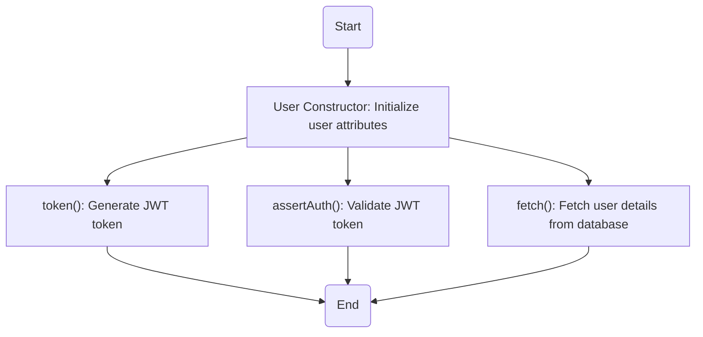
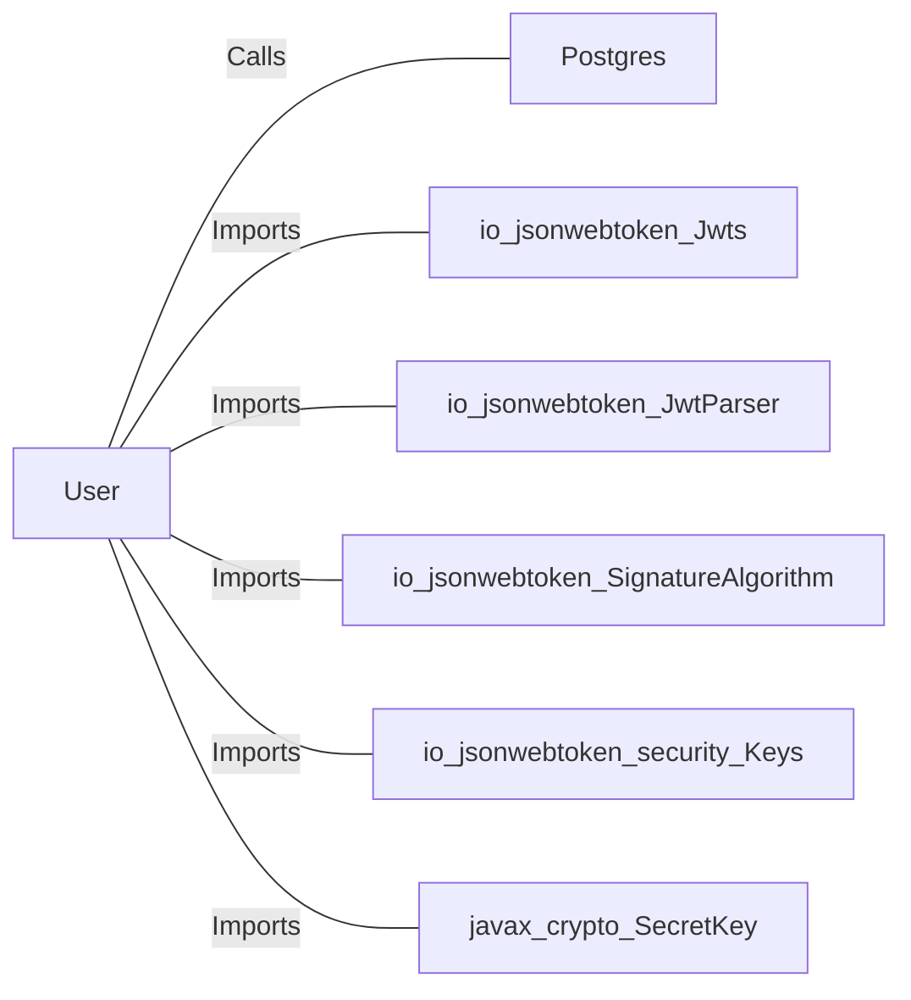

# User.java: User Management and Authentication

## Overview
The `User` class is responsible for managing user-related data and operations, including token generation, authentication, and fetching user details from a database. It provides methods for creating JWT tokens, validating them, and retrieving user information from a PostgreSQL database.

## Process Flow

## Insights
- **Token Generation**: The `token()` method generates a JWT token using the user's username and a secret key.
- **Token Validation**: The `assertAuth()` method validates a JWT token using the provided secret key. If validation fails, it throws an `Unauthorized` exception.
- **Database Interaction**: The `fetch()` method retrieves user details from a PostgreSQL database using a raw SQL query.
- **Potential Vulnerabilities**:
  - **SQL Injection**: The `fetch()` method constructs SQL queries using string concatenation, making it vulnerable to SQL injection attacks.
  - **Hardcoded Secret Key**: The `token()` and `assertAuth()` methods rely on a secret key passed as a string, which could lead to security issues if not managed securely.
  - **Error Handling**: Exceptions are printed to the console but not logged securely, which could expose sensitive information.

## Dependencies

- `Postgres`: Provides the database connection for fetching user details.
- `io.jsonwebtoken.Jwts`: Used for creating and parsing JWT tokens.
- `io.jsonwebtoken.JwtParser`: Used for parsing JWT tokens.
- `io.jsonwebtoken.SignatureAlgorithm`: Specifies the algorithm for signing JWT tokens.
- `io.jsonwebtoken.security.Keys`: Used for generating cryptographic keys.
- `javax.crypto.SecretKey`: Represents the secret key used for signing JWT tokens.

## Data Manipulation (SQL)
### Table Structure: `users`
| Attribute   | Type       | Description                          |
|-------------|------------|--------------------------------------|
| `user_id`   | String     | Unique identifier for the user.      |
| `username`  | String     | Username of the user.                |
| `password`  | String     | Hashed password of the user.         |

### SQL Command
- **Query**: `SELECT * FROM users WHERE username = '<username>' LIMIT 1`
  - **Operation**: SELECT
  - **Description**: Fetches user details based on the provided username.

## Vulnerabilities
1. **SQL Injection**:
   - The `fetch()` method uses string concatenation to construct SQL queries, making it susceptible to SQL injection attacks.
   - **Mitigation**: Use prepared statements or parameterized queries to prevent SQL injection.

2. **Weak Secret Key Management**:
   - The secret key for JWT token generation and validation is passed as a string, which could be exposed or mismanaged.
   - **Mitigation**: Store the secret key securely using environment variables or a secrets management tool.

3. **Error Handling**:
   - Exceptions are printed to the console, potentially exposing sensitive information.
   - **Mitigation**: Implement secure logging practices and avoid exposing stack traces in production environments.
