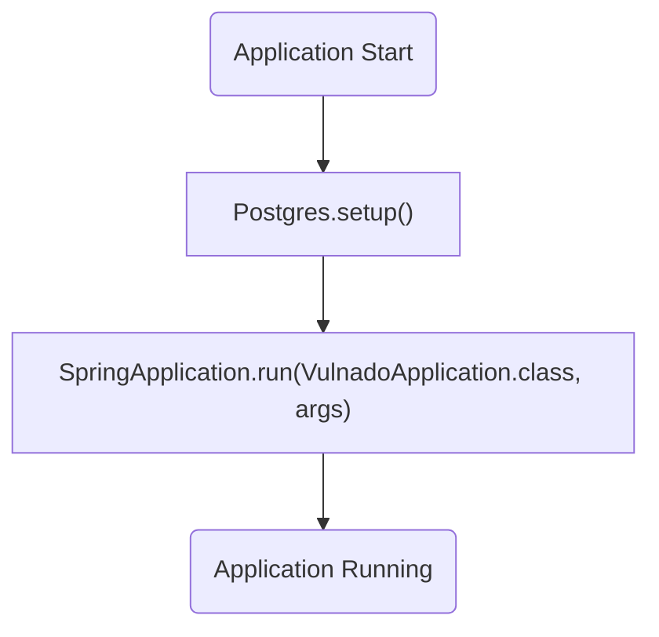
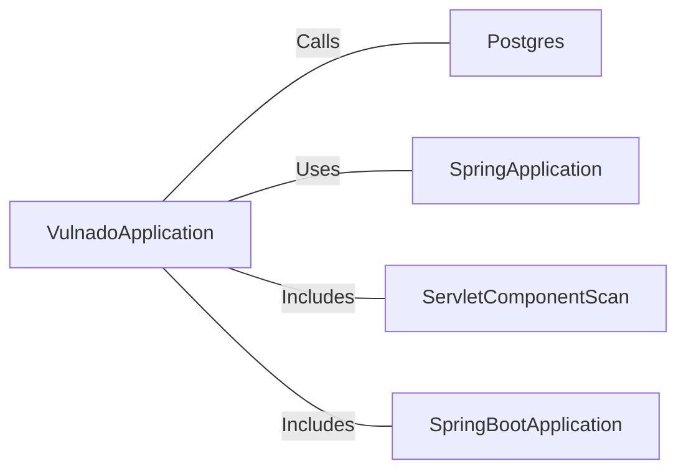

# VulnadoApplication.java: Spring Boot Application Entry Point

## Overview
This file serves as the entry point for the `Vulnado` application, a Spring Boot-based application. It initializes the application context and sets up necessary configurations, including database setup through the `Postgres.setup()` method.

## Process Flow

## Insights
- The `@SpringBootApplication` annotation marks this class as the main configuration class for the Spring Boot application.
- The `@ServletComponentScan` annotation enables scanning for servlet components, such as filters and listeners, within the application.
- The `Postgres.setup()` method is called before the application starts, indicating that database setup is a critical step in the initialization process.
- The `SpringApplication.run()` method starts the Spring Boot application, initializing the application context and launching the embedded server.

## Dependencies

- `Postgres`: The `setup()` method is called to configure the database before the application starts.
- `SpringApplication`: Used to bootstrap and launch the Spring Boot application.
- `ServletComponentScan`: Enables scanning for servlet components.
- `SpringBootApplication`: Marks the class as the main configuration class for the Spring Boot application.

## Vulnerabilities
- **Potential Database Misconfiguration**: The `Postgres.setup()` method is called without any visible error handling or validation. If the database setup fails, it could lead to application startup issues or runtime errors.
- **Servlet Component Exposure**: The `@ServletComponentScan` annotation scans for servlet components, which could inadvertently expose sensitive endpoints or filters if not properly secured.
- **Hardcoded Dependencies**: The direct call to `Postgres.setup()` assumes that the `Postgres` class is correctly implemented and available. Any issues in the `Postgres` class could lead to application failure.
